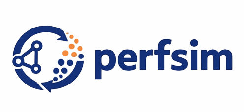

<p align="center">
  
</p>

A benchmark library for performative prediction (PP): settings where a deployed model changes the distribution it is then evaluated and retrained on. The central object is the **distribution map** D: Theta -> Delta(Z) (Perdomo et al. 2020). perfsim makes the map a first-class primitive, makes the field's access hierarchy part of the type system, and provides the retraining loop, environments, and measurement tools around it.

Design follows the taxonomy of Kehrenberg et al. 2026 (arXiv:2602.10176), which names the gap this library targets: no standard testbed serves every level of access to the distribution map.

## The distribution map

A map is stateless and pure: give it model parameters, it gives back samples. Most maps in the literature are a fixed base population plus a theta-dependent transformation, which is `TransformationMap`; you write two methods and sampling is derived:

```python
import torch
from perfsim import TransformationMap
from perfsim.core import SUPERVISED_SCHEMA

class CreditGamingMap(TransformationMap):
    """Applicants shift gameable features toward the classifier's weights."""

    model_channel = "parameters"   # this map reads theta itself

    def __init__(self, x0, y, eps=0.5):
        self._x0, self._y, self._eps = x0, y, eps

    @property
    def produces_schema(self):
        return SUPERVISED_SCHEMA

    def sample_base(self, n, *, generator):
        idx = torch.randint(self._x0.shape[0], (n,), generator=generator)
        return {"x": self._x0[idx], "y": self._y[idx]}

    def transform(self, z_base, model):
        return {"x": z_base["x"] + self._eps * model.params, "y": z_base["y"]}
```

Maps see the deployed model through a `ModelView`. The prediction channel is always open; the parameter channel opens only when the map declares `model_channel = "parameters"`. Reading an undeclared channel raises `AccessError`. What a component was allowed to see is enforced by the API, not by convention.

## The access pyramid

The survey classifies PP methods by how much of D they may touch. In perfsim that hierarchy is the type hierarchy:

| Level | Meaning | perfsim type |
|---|---|---|
| 1b | cheap black-box samples | `DistributionMap.sample` |
| 2a | base distribution + transformation function | `TransformationMap` |
| 2b | parameterized density | `DensityMap.log_prob` |

`access_levels(map)` reports what a map exposes. Level 1a (expensive real-deployment samples) and learner-side access enforcement are on the roadmap.

## Running the PP loop

Wrap a map in `MapEnvironment` to run it in the epoch loop. Repeated retraining (RRM) is `ERMLearner`; the Gaussian shift family has a closed-form fixed point to converge to:

```python
import torch
from perfsim import GaussianShiftMap, MapEnvironment, Simulator
from perfsim.learners import ERMLearner
from perfsim.losses import MSELoss
from perfsim.models import LinearModel

gmap = GaussianShiftMap(A=0.5 * torch.eye(3), b=torch.ones(3), sigma_noise=0.01)
env = MapEnvironment(gmap, batch_size=256)

model = LinearModel(3, 1, bias=False)
loss = MSELoss()
sim = Simulator(env=env, learner=ERMLearner(model, loss), loss=loss)
history = sim.run(n_rounds=20, epoch_size=1, seed=0)

print(model.get_params(), "vs", gmap.closed_form_fp())
```

Each outer round: the learner trains on the previous round's data, the model is deployed, the environment produces the next data. With `epoch_size > 1` the population evolves under frozen parameters between retrainings (Algorithm 1 in the stateful worlds).

## Map families included

- `StrategicLinearMap`: quadratic-cost strategic classification (Perdomo et al. 2020)
- `LocationScaleMap`: linear-in-theta location and scale shifts (Miller et al. 2021)
- `GaussianShiftMap`: all three access levels plus a closed-form RRM fixed point

More families from the survey's inventory (resampled-if-rejected, group-mixture shift, outcome performativity) are planned.

## Worlds: stateful simulators

True simulators with internal state stay native `Environment`s: Friedkin-Johnsen opinion dynamics, the recommender ecosystem, replicator dynamics, AgentTorch ABMs. They are honestly described as worlds whose induced map is reachable only at level 1b by running them. This is the realistic tier the survey calls for: rich distribution maps beyond feature-space transformations.

## Stateful PP: transition maps

Any map can be lifted into a transition map `Tr(theta, Q_{t-1})` that models slow adaptation: `GeometricDecayEnv(map, lam=...)` (geometric decay) and `StaggeredResponseEnv(map, k=...)`. These keep an empirical sample buffer; run them at `epoch_size=1` so each round applies one `Tr(theta_t, Q_{t-1})`. `limiting_distribution` and `long_term_performative_risk` in `metrics.py` give the limiting distribution `D_inf(theta)` and long-term risk `PR_inf(theta)` (eqs 10-11). Both combinators reshape the transient; their limit is `D(theta)`.

## Layout

```
perfsim/
  perfsim/                        # importable library
    maps/                         # THE CENTRAL PACKAGE
      base.py                     # DistributionMap / TransformationMap / DensityMap,
                                  # ModelView, AccessError, access_levels
      location_scale.py           # canonical families
      strategic.py
      gaussian_shift.py
    core/                         # ML plumbing: Model, Loss, Learner, Predictor,
                                  # Dataset, schemas, Environment ABCs
    environments/
      map_env.py                  # MapEnvironment adapter (map -> epoch loop)
      dynamics/                   # FJ, replicator, strategic worlds, gaussian shift
    learners/
      erm.py                      # ERM solved to convergence (RRM)
      gradient.py                 # k SGD/Adam steps per round (RGD at k=1)
      lm/                         # SFT and KL-SFT learners for HF causal LMs
    models/                       # linear, logistic, MLP, HFCausalLM
    scenarios/
      perdomo_loan/               # Perdomo 2020 replication
      at_covid/                   # AgentTorch COVID ABM scenario
      recommender/                # performative recommender ecosystem
    adapters/
      agenttorch.py               # wraps agent_torch.Runner as perfsim env
    simulator.py                  # outer epoch loop
    history.py / metrics.py / losses.py
  experiments/                    # NOT part of the package
  tests/
  examples/                       # marimo notebooks
```

Dependency rule: `maps/` depends only on `core` primitives (types, model); `environments/` depend on `maps/`; never the reverse.

## Install

```bash
pip install -e .                 # core (torch, numpy, pandas)
pip install -e ".[lm]"          # + transformers, peft, trl, accelerate
pip install -e ".[agenttorch]"  # + agent_torch for ABM scenarios
pip install -e ".[dev]"         # + pytest, ruff, mypy
```

See `pyproject.toml` for all extras: `[tabular]`, `[kaggle]`, `[hf]`, `[trl]`, `[vllm]`.

## Capability protocols

Optional protocols an Environment may declare:

- `Differentiable`: `grad_sample(model)` is autograd-traceable (oracle access; an upper-bound baseline, not a pyramid level).
- `FullyDifferentiable`: full inner-loop rollout is autograd-traceable.
- `Rewarding`: fills a `reward` field in the data dict (for RL learners).
- `Trajectory`: produces multi-step trajectory tensors with a leading time axis.
- `ClosedFormFixedPoint`: provides an analytic fixed point for validation.

## Roadmap

Headlines: learner-side access enforcement with stamped benchmark results, fitted maps (`fit(observations)`) sharing the map interface so StatErr/MisspecErr is measurable, assumption diagnostics (epsilon-sensitivity, mixture dominance) reported as estimates with probe sets, and the remaining map families from the survey.

## Implementation TODOs

- [ ] mastodon-sim PP loop (built in `mastodon-sim/pp_loop/`, separate repo) LLM recommender ranks posts for Concordia agents, engagement is the SFT signal, opinion shift measured via probes + BERT stance/sentiment analysis.
- [ ] AT LLM archetype agents as strategic population layer: frozen API models (GPT-4, Claude, Llama) make per-agent decisions via AT archetype prompting with current state context, while the outer perfsim model (HFCausalLM) is SFT/KL fine-tuned each round as usual.
- [ ] vLLM integration for faster LM inference during generation sweeps
- [ ] RL learners (PPO, GRPO, DPO) with trajectory data schema
- [ ] Change data collection settings (refresh data set each round or append growing data)
- [ ] Learned surrogate (D-hat) for PerfGD without running the full ABM
- [ ] Add in Hydra to configure experiments

## Dropped / parked

- **Macro ABM (`at_macro/`)**: I found many bugs with the simulator had to change so much that it wasn't faithful hence dropping.
