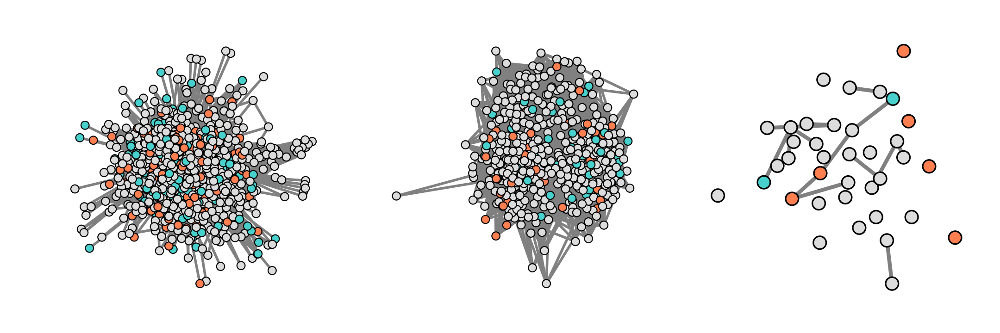

# OpiniMARL

OpiniMARL is an open-source codebase for exploring opinion dynamics with multi-agent reinforcement learning (MARL). We use an end-to-end JAX framework, allowing for fast training of 1000 agents in ~30 minutes.
OpiniMARL supports a range of randomly generated network classes as well as some real-world network datasets, though it is is also possible to define custom networks. Additionally, we support dynamic networks, with a parameter that controls the rate with which potential neighbours switch between interacting and non-interacting states.

Agents learn to play a truth-finding game, where each individual is given a noisy signal of a binary ground-truth value $\Psi \in \{0,1\}$, and must subsequently guess this value in each round, by accumulating information from neighbouring guesses in previous timesteps.

<p align="center">
  
</p>
<p align="middle">
<b>The above shows example episodes for Bluesky (left), Congress X/Twitter (middle), and Hadza hunter-gather (right) networks.</b>
</p>

# Paper TL;DR
We explore the potential of MARL for opinion dynamics, where non-trivial local interaction rules can be learned via simple reward functions instead of hand-crafting them, allowing for direct analysis of how individual incentives give rise to macroscopic phenomenon at the population level. We train agents in a GPU accelerated consensus and truth-finding game, that allows us to train 1000 agents in ~30 minutes, and adopt other-play to prevent the learning of unrealistic conventions. We validate our model on a subset of the Bluesky network by extracting learned attention weights and recovering true agent importance structures, which we use to show that highly conforming populations most closely match the human data. We further find that population accuracy in conforming populations is significantly worse in social media networks compared to small, dynamic hunter-gatherer networks, and that the fraction of dishonest agents increases.

Full paper: [https://arxiv.org/abs/2606.07487](https://arxiv.org/abs/2606.07487).

# How to use

## Installation
To install (python 3.10):
```
git clone https://github.com/flipbagels/OpiniMARL.git
cd OpiniMARL
pip install -e ".[dev]"
```

To install hardware relevant jax packages see [here](https://docs.jax.dev/en/latest/installation.html).

## Training and Evaluating
We use [hydra](https://hydra.cc/) to manage configs. For full control over these, see the ```config/``` directory.

To train a population of agents, set ```BASE_PATH``` to your base directory in which you want to log data, and set ```GRAPH_CONFIG_PATH``` to the desired graph in ```config/```:
```
BASE_PATH="${pwd}"
GRAPH_CONFIG_PATH=graph=datasets/bluesky
```

Then run the following:
```
python scripts/train.py +graph=${GRAPH_CONFIG_PATH} path.BASE_DIR=${BASE_PATH}
```

For [wandb](https://wandb.ai/) logging, set the wandb project and entity, with WANDB_MODE set to online.
```
python scripts/train.py \
    +graph=${GRAPH_CONFIG_PATH} \
    path.BASE_DIR=${BASE_PATH} \
    wandb.PROJECT="[YOUR_PROJECT]" \
    wandb.ENTITY="[YOUR_ENTITY]" \
    wandb.WANDB_MODE=online \
```
To evaluate a population of trained agents, run the following:
```
python scripts/eval.py +graph=${GRAPH_CONFIG_PATH} path.BASE_DIR=${BASE_DIR}
```
# Datasets
We support a few real world network datasets in this repository.

## Bluesky
This dataset of the Bluesky machine learning community was created as part of the original paper. It consists of 1000 nodes with 14559 weighted and directed edges, where a weight $w_{ij}$ corresponds to fraction of user $j$'s posts that user $i$ has liked, normalised over all of user $i$'s neighbours. Full details of how the dataset was generated can be found in the appendix of our [paper](https://arxiv.org/abs/2606.07487).

## Congress X/Twitter
This dataset consists of a 475 nodes and 13289 weighted and directed edges, based on user interactions on the X/Twitter platform. For more details, see the orignal publication [here](https://arxiv.org/abs/2303.09684).

## Hadza hunter-gather tribe
This dataset consists of 37 nodes, which is the largest component from the camp2 out-of-camp Hadza dataset originally published [here](https://datadryad.org/dataset/doi%3A10.5061/dryad.nk98sf7v6). The dataset captures the fraction of day for which any two selected individuals spend within two metres of one another. We use these values along with a Markov process model of a dynamic network to capture interaction behaviours up to a free parameter that determines the rate of switching between interacting and non-interacting states.

# Citation
If you use any of this code or the included Bluesky dataset in your work, please cite us with the following:
```
@misc{seier2026modelling,
      title={Modelling Opinion Dynamics at Scale with Deep MARL}, 
      author={Lukas Seier and Brandon Kaplowitz and Sebastian Towers and Richard Bailey and Jakob Foerster},
      year={2026},
      url={https://arxiv.org/abs/2606.07487}
}
```


